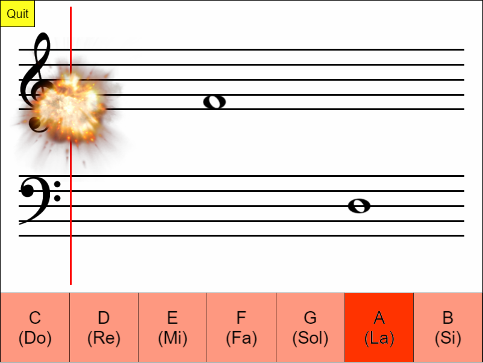

## Identify The Note

Press the correct button before the note touches the red line and explodes :boom:

[:arrow_right: Click here to play](https://lzh9102.github.io/IdentifyTheNote)

## Screenshot

## Keyboard Shortcuts

| Action | Keys                        |
| ------ | --------------------------- |
| C (Do) | <kbd>C</kbd> , <kbd>1</kbd> |
| D (Re) | <kbd>D</kbd> , <kbd>2</kbd> |
| E (Mi) | <kbd>E</kbd> , <kbd>3</kbd> |
| F (Fa) | <kbd>F</kbd> , <kbd>4</kbd> |
| G (Sol)| <kbd>G</kbd> , <kbd>5</kbd> |
| A (La) | <kbd>A</kbd> , <kbd>6</kbd> |
| B (Si) | <kbd>B</kbd> , <kbd>7</kbd> |
| Quit   | <kbd>Esc</kbd>              |

## Development

1. Install dependencies: `npm install`
2. Build: `npm run build`
3. Run development server: `npm run server`
4. Deploy: `npm run deploy`

## Copyright

See [License](LICENSE.txt)

## Acknowledgements

- This project uses the following libraries
    * [PixiJS](http://www.pixijs.com/) (MIT License)
    * [pixi-sound](https://github.com/pixijs/pixi-sound) (MIT License)
    * [pixi-timeout](https://www.npmjs.com/package/pixi-timeout) (MIT License)
    * [MIDI.js](https://github.com/mudcube/MIDI.js/) (MIT License)
    * [jQuery](https://jquery.com/) (MIT License)
    * [Head.JS](https://github.com/headjs/headjs) (MIT License)
    * [js-cookie](https://github.com/js-cookie/js-cookie) (MIT License)
- Musical notation symbols taken from Wikimedia Commons (Public Domain)
- Sound effects
    * [Explosion](https://freesound.org/people/cydon/sounds/268557/) (Public
      Domain)
    * Wrong answer beep generated using [Audacity](https://www.audacityteam.org/)
